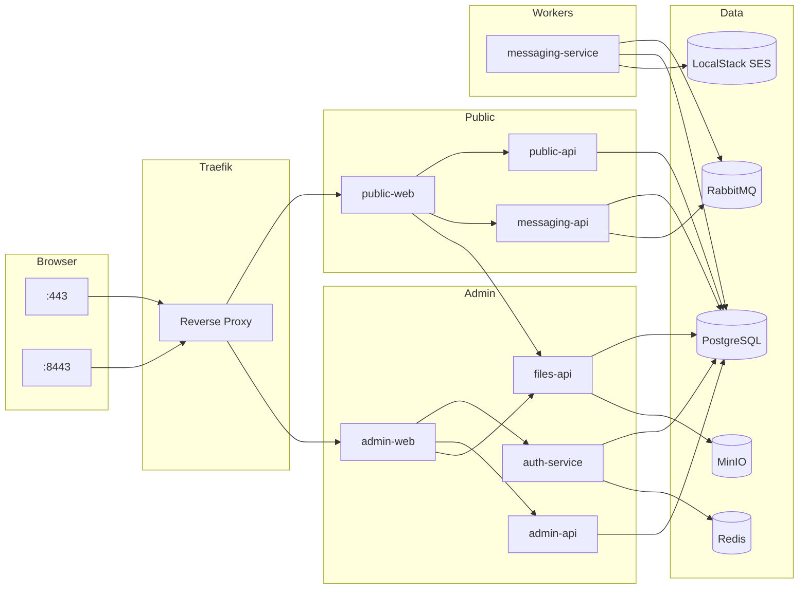
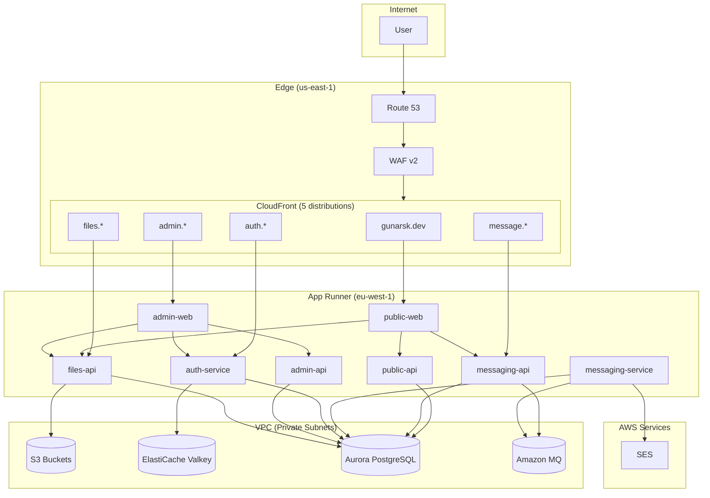

# Portfolio Architecture

## Overview

The portfolio project uses a microservices architecture with 6 Go backend services
and 2 Vue.js frontends. Infrastructure differs between local development
(Docker Compose) and production (AWS).

---

## Service Inventory

| Service | Port | Purpose | Database User |
| ------- | ---- | ------- | ------------- |
| auth-service | 8084 | JWT authentication, sessions | portfolio_admin |
| public-api | 8082 | Read-only public data | portfolio_public |
| admin-api | 8083 | Admin CRUD operations | portfolio_admin |
| files-api | 8085 | File upload/download | portfolio_admin |
| messaging-api | 8086 | Contact form API | portfolio_messaging |
| messaging-service | 8087 | Email worker (RabbitMQ) | portfolio_messaging |
| public-web | 80 | Public Vue.js frontend | - |
| admin-web | 80 | Admin Vue.js frontend | - |

---

## Local Development Architecture



### Data Flows

| Flow | Path |
|------|------|
| Portfolio data | public-web → public-api → PostgreSQL |
| Contact form | public-web → messaging-api → PostgreSQL + RabbitMQ |
| Email notifications | messaging-service → RabbitMQ → SES |
| Public images | public-web → files-api → PostgreSQL + MinIO |
| Login/sessions | admin-web → auth-service → PostgreSQL + Redis |
| Admin CRUD | admin-web → admin-api → PostgreSQL |
| File uploads | admin-web → files-api → PostgreSQL + MinIO |

### Traefik Routing

| Entrypoint | Path | Routes To |
|------------|------|-----------|
| :443 | `/*` | public-web |
| :443 | `/api/*` | public-api |
| :443 | `/message/*` | messaging-api |
| :8443 | `/*` | admin-web |
| :8443 | `/auth/v1/*` | auth-service |
| :8443 | `/admin-api/*` | admin-api |
| :8443 | `/files-api/*` | files-api |

### Service → Data Store Connections

| Service | PostgreSQL Role | Redis | RabbitMQ | MinIO | SES |
|---------|-----------------|-------|----------|-------|-----|
| public-api | portfolio_public (SELECT only) | - | - | - | - |
| messaging-api | portfolio_messaging | - | ✓ (publish) | - | - |
| messaging-service | portfolio_messaging | - | ✓ (consume) | - | ✓ |
| auth-service | portfolio_admin | ✓ | - | - | - |
| admin-api | portfolio_admin | - | - | - | - |
| files-api | portfolio_admin | - | - | ✓ | - |

### Message Queue Strategy

**Queue Configuration:**

- Exchange: `contact_messages` (direct)
- Queue: `contact_messages` (durable)
- Retry delays: 1m → 5m → 30m → 2h → 12h (exponential backoff)

**Message Durability:**

- Messages are persistent (delivery mode 2)
- Queue is durable (survives broker restart)
- Consumer uses manual acknowledgment

**Retry & Dead Letter Handling:**

- Failed messages are requeued with delay headers
- After 5 retries (12h total), message is moved to DLQ
- DLQ: `contact_messages.dlq` (manual inspection required)

**Consumer Scaling:**

- Single consumer instance (contact form volume is low)
- Prefetch limit: 1 (process one message at a time)
- For higher volume: scale horizontally with `consumer_tag` uniqueness

**Monitoring:**

| Metric | Threshold | Action |
|--------|-----------|--------|
| Queue depth | >100 messages | Investigate consumer health |
| Consumer lag | >5 minutes | Check messaging-service logs |
| DLQ depth | >0 | Manual review required |

Docker Network: `infrastructure_network`
Volumes: `postgres_data`, `redis_data`, `rabbitmq_data`, `localstack_data`, `minio_data`

### Local Service URLs

| Service | URL |
|---------|-----|
| Public Site | <https://localhost> |
| Admin Panel | <https://localhost:8443> |
| Swagger Docs | <http://localhost:82> |
| Traefik Dashboard | <http://localhost:9002> |
| RabbitMQ Management | <http://localhost:15672> |
| MinIO Console | <http://localhost:9001> |

---

## Production Architecture (AWS)



### AWS Resource Summary

| Resource | Service | Configuration |
|----------|---------|---------------|
| Compute | App Runner | 8 services, auto-scaling 1-4 |
| Database | Aurora Serverless v2 | PostgreSQL 17, 0.5-4 ACU |
| Cache | ElastiCache Serverless | Valkey 8.x |
| Message Queue | Amazon MQ | RabbitMQ 3.13, mq.t3.micro |
| Email | SES | Transactional email delivery |
| CDN | CloudFront | 5 distributions, TLS 1.3 |
| DNS | Route53 | A/AAAA records → CloudFront |
| WAF | WAF v2 | OWASP rules, rate limiting |
| Storage | S3 | 3 buckets, KMS encrypted |
| Secrets | Secrets Manager | DB passwords, JWT secret, Redis token, RabbitMQ |
| Monitoring | CloudWatch | Dashboards, alarms, SNS alerts |
| Audit | CloudTrail | API logging, 90-day retention |
| Threats | GuardDuty | Automated threat detection |

### Disaster Recovery

| Component | Strategy | Details |
|-----------|----------|---------|
| Aurora | Automated backups | 30-day retention, point-in-time recovery |
| Aurora | Single AZ | Writer instance only (cost optimization) |
| ElastiCache | Single node | 30-day snapshot retention |
| S3 | Versioning | Enabled, 90-day noncurrent version expiration |
| S3 | Cross-region | Not configured (single-region deployment) |

**Recovery Targets (estimated):**

- RPO: ~5 minutes (Aurora continuous backup)
- RTO: ~30-60 minutes (Aurora restore + App Runner restart)

**Backup Windows:**

- Aurora: Daily 03:00-04:00 UTC
- ElastiCache: Daily 02:00-03:00 UTC

**Note:** Current configuration prioritizes cost over high availability.
For production HA, consider adding Aurora reader instance and ElastiCache replica.

### App Runner Health Checks

| Setting | Value |
|---------|-------|
| Endpoint | Service-specific (e.g., `/health`) |
| Protocol | HTTP |
| Interval | 10 seconds |
| Timeout | 5 seconds |
| Healthy threshold | 2 consecutive successes |
| Unhealthy threshold | 3 consecutive failures |

Unhealthy instances are replaced automatically. See
[app-runner module](../terraform/modules/app-runner/main.tf) for paths.

---

## Data Flow

### Authentication Flow

```text
User Login Request
        │
        ▼
┌───────────────┐      ┌───────────────┐      ┌───────────────┐
│   CloudFront  │ ───▶ │  auth-service │ ───▶ │    Aurora     │
│   (WAF: 10/5m)│      │  (validate)   │      │ (verify hash) │
└───────────────┘      └───────┬───────┘      └───────────────┘
                               │
                               ▼
                       ┌───────────────┐
                       │  ElastiCache  │
                       │(store session)│
                       └───────────────┘
                               │
                               ▼
                    JWT Access + Refresh Tokens
```

### File Upload Flow

```text
File Upload Request (multipart)
        │
        ▼
┌───────────────┐      ┌───────────────┐       ┌───────────────┐
│   CloudFront  │ ───▶ │   files-api   │ ───▶ │      S3       │
│(WAF: 300/5m)  │      │(validate type)│       │ (store file)  │
└───────────────┘      └───────┬───────┘       └───────────────┘
                               │
                               ▼
                       ┌────────────────┐
                       │    Aurora      │
                       │(store metadata)│
                       └────────────────┘
```

### Public Read Flow

```text
Public Page Request
        │
        ▼
┌───────────────┐      ┌───────────────┐       ┌───────────────┐
│   CloudFront  │ ───▶ │  public-api   │ ───▶ │    Aurora     │
│(WAF: 600/5m)  │      │               │       │ (SELECT only) │
│ (cache: 60s)  │      │               │       │               │
└───────────────┘      └───────────────┘       └───────────────┘
```

### Contact Message Flow

```text
Contact Form Submission
        │
        ▼
┌───────────────┐      ┌───────────────┐      ┌───────────────┐
│   CloudFront  │ ───▶ │ messaging-api │ ───▶ │    Aurora     │
│ (WAF: 10/5m)  │      │ (validate)    │      │(store message)│
└───────────────┘      └───────┬───────┘      └───────────────┘
                               │
                               ▼
                       ┌───────────────┐
                       │   RabbitMQ    │
                       │(publish event)│
                       └───────┬───────┘
                               │
                               ▼
                       ┌───────────────┐      ┌───────────────┐
                       │  messaging-   │ ───▶ │      SES      │
                       │   service     │      │ (send email)  │
                       └───────────────┘      └───────────────┘
```

---

## Security Layers

### WAF Rate Limits

All limits are per IP address per 5-minute window:

| Endpoint | Limit | Rationale |
|----------|-------|-----------|
| Login (`/login`) | 10 | Brute-force prevention |
| Refresh (`/refresh`) | 100 | Token refresh cycles |
| Validate (`/validate`) | 600 | Internal service calls |
| Logout (`/logout`) | 60 | Session cleanup |
| Admin API | 300 | Authenticated CRUD operations |
| Public API | 600 | Read-only public data |
| Files API | 300 | Upload/download operations |
| Messaging | 10 | Contact form spam prevention |

**Note:** Thresholds are operational estimates, not load-tested.
Monitor WAF block metrics in CloudWatch and adjust based on real-world patterns.
See [waf module](../terraform/modules/waf/main.tf) for complete rule configuration.

```text
Layer 1: WAF
├── Rate limiting per endpoint (see table above)
├── OWASP Core Rule Set
├── SQL injection protection
├── Known bad inputs
└── IP reputation filtering

Layer 2: CloudFront
├── TLS 1.3 minimum
├── Security headers (HSTS, CSP)
├── Geographic restrictions (optional)
└── Origin access control

Layer 3: App Runner
├── VPC connector (private networking)
├── IAM roles (least privilege)
├── Environment variables from Secrets Manager
└── Health checks

Layer 4: Database
├── Private subnet only
├── Security group: App Runner SG only
├── Role-based access (admin/public/messaging)
├── TLS enforced
└── pgaudit logging
```

---

## Secrets Management

### Production (Secrets Manager)

| Secret | Used By |
|--------|---------|
| aurora-admin-password | auth-service, admin-api, files-api |
| aurora-public-password | public-api |
| aurora-messaging-password | messaging-api |
| redis-auth-token | auth-service |
| jwt-secret | auth-service, all APIs (validation) |

### Local Development (.env files)

See [.env.example](../.env.example) for all required environment variables.
Generate secure credentials with `task secrets:generate`.

---

## Monitoring

### Production Alarms

| Alarm | Threshold | Action |
|-------|-----------|--------|
| CloudFront 5xx Rate | >5% | SNS notification |
| App Runner Latency p99 | >2s | SNS notification |
| Aurora CPU | >80% | SNS notification |
| Aurora Connections | >400 | SNS notification |
| ElastiCache Memory | >80% | SNS notification |
| WAF Block Rate | >100/5min | SNS notification |

### Log Retention

| Log Type | Retention | Location |
|----------|-----------|----------|
| App Runner | 7 days | CloudWatch |
| WAF | 30 days | CloudWatch |
| VPC Flow | 90 days | CloudWatch |
| CloudTrail | 90 days | CloudWatch + S3 |
| Aurora | 7 days | CloudWatch |

---

## Deployment

### Local Development

```bash
cd infrastructure
docker-compose up -d
# Wait for Flyway migrations
# Access: https://localhost (public), https://localhost:8443 (admin)
```

### Production (GitHub Actions)

```text
Tag Push (v*)
     │
     ▼
┌─────────────────┐
│  Build & Test   │ ← Lint, unit tests, security scans
└────────┬────────┘
         │
         ▼
┌─────────────────┐
│   Push to ECR   │ ← Docker images
└────────┬────────┘
         │
         ▼
┌─────────────────┐
│ App Runner Auto │ ← Automatic deployment on image push
│    Deploy       │
└─────────────────┘
```

---

## Network Ports Reference

### Local Dev Ports

| Port | Service |
|------|---------|
| 443 | Public HTTPS (Traefik) |
| 8443 | Admin HTTPS (Traefik) |
| 5432 | PostgreSQL (localhost only) |
| 6379 | Redis (localhost only) |
| 5672 | RabbitMQ AMQP (localhost only) |
| 15672 | RabbitMQ Management (localhost only) |
| 4566 | LocalStack SES (localhost only) |
| 9000 | MinIO API |
| 9001 | MinIO Console |
| 9002 | Traefik Dashboard |

### Production (Internal)

| Port | Service | Access |
|------|---------|--------|
| 5432 | Aurora | App Runner SG only |
| 6379 | ElastiCache (write) | App Runner SG only |
| 6380 | ElastiCache (read) | App Runner SG only |
| 5671 | Amazon MQ RabbitMQ (AMQPS) | App Runner SG only |

---

*Architecture diagrams represent the current infrastructure design.*
